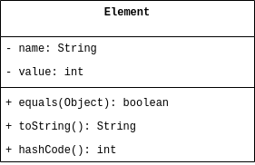
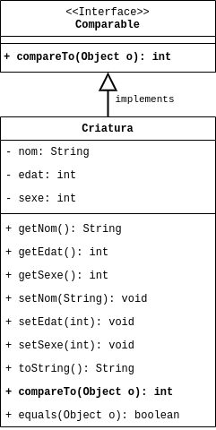

## Ens basarem en aquestes classes per fer els següents exercicis:

### Ìndex de **Classes**

1. **Classe** [**`Element`**](#primera-classe-element)

1. **Classe** [**`Criatura`**](#segona-classe-criatura)

3. **Interfície** [**`Mainaderia`**](#tercera-interfície-mainaderia)

## Primera Classe **`Element`**

### Diagrama UML - Classe **`Element`**

### Desenvolupament - Classe **`Element`**

Podeu trobar el codi al fitxer [**`Element.java`**](../src/classes/Element.java).

[Torna a ìndex de **classes**](#ìndex-de-classes)

## Segona Classe **`Criatura`**

### Diagrama UML - Classe **`Criatura`**

### _Desenvolupament_ - Classe **`Criatura`**

Podeu trobar el codi al fitxer [**`Criatura.java`**](../src/classes/Criatura.java).

[Torna a ìndex de **classes**](#ìndex-de-classes)

## Tercera interfície **`Mainaderia`**

A continuació veiem l'exemple de la definició d'una **`interfície`** anomenada **`Mainaderia`** que fa servir la **Classe** [**`Criatura`**](../src/classes/Criatura.java)

[Torna a ìndex de **classes**](#ìndex-de-classes)

## [Anterior **`Portada`**](./01-portada.md)

## [Següent **`Exercici_00`**](./03-exercici-00.md)
